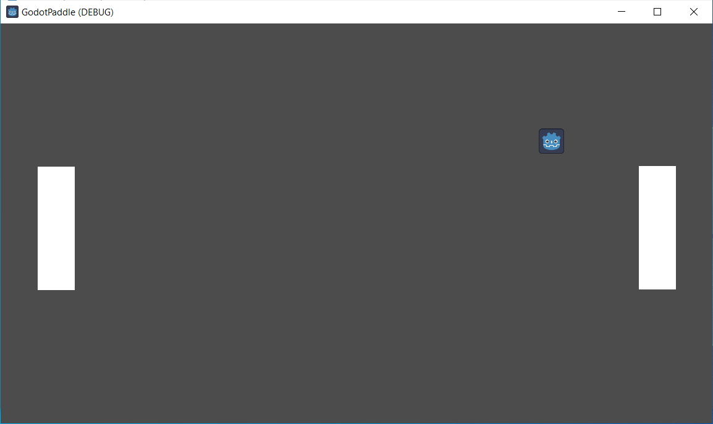

# Games in Godot! Let’s make a classic Paddle game with C#!

## Abstract

Let’s start from the ground up and get familiar with Godot to recreate a classic game. We’ll add two paddles, a ball, and some walls and bounce around!

## Link to Session Recording

[Event Recording](https://aka.ms/netconf23/studentstream)

## Overview

In this session, we will discuss how to get started with Godot and C# from the ground up!

| **Goal**                 | Get an initial C# Godot project running with some basic interaction and code.              |
| -------------------------| ------------------------------------------------------------------------------------------ |
| **What will you learn**  | Setting up Godot & VS Code for C# development, Debugging, Basic Physics Engine Constructs. |
| **What you'll need**     | VS Code, Godot                                                                             |
| **Technology used**      | C#, Godot                                                                                  |
| **Follow along**         | We install the [`Mikeware.GoDotNet.BlankTemplate`](https://github.com/Mikeware/GoDotNet.BlankTemplate) template during the session to get started! |
| **Just want to try the app or see the solution?** | See the `src` folder and select the `project.godot` file to `Import` into Godot.  |
| **Slides**               | [PDF](slides.pdf)                                                                          |

## Pre-Learning

The template expects an `Environment Variable` to help locate the Godot installation on your machine, _this is optional_. However, if you're not familiar with this topic and looking for more information, then [this is a good article from TheWindowsClub](https://www.thewindowsclub.com/system-user-environment-variables-windows).

The [**official Godot docs**](https://docs.godotengine.org/en/stable/index.html) have plenty of information! We cover a lot in a short time during the session. So, if you're looking for more details on some of what we've covered, then look at these pages there:

- [Introduction to Godot](https://docs.godotengine.org/en/latest/getting_started/introduction/introduction_to_godot.html)
- [Nodes and Scenes](https://docs.godotengine.org/en/stable/getting_started/step_by_step/nodes_and_scenes.html)
- [Physics Introduction](https://docs.godotengine.org/en/stable/tutorials/physics/physics_introduction.html)
  - [Physics and Idle Processing](https://docs.godotengine.org/en/stable/tutorials/scripting/idle_and_physics_processing.html)
  - [Physics Material](https://docs.godotengine.org/en/stable/classes/class_physicsmaterial.html)
  - [Linear Damp explanation](https://docs.godotengine.org/en/latest/classes/class_projectsettings.html#class-projectsettings-property-physics-2d-default-linear-damp)
  - [CharacterBody2D](https://docs.godotengine.org/en/stable/tutorials/physics/using_character_body_2d.html)
- [Input Handling](https://docs.godotengine.org/en/stable/tutorials/inputs/index.html)
  - [Input.GetVector method](https://docs.godotengine.org/en/stable/classes/class_input.html#class-input-method-get-vector)
  - [Input Actions/Mapping](https://docs.godotengine.org/en/stable/getting_started/first_3d_game/02.player_input.html#creating-input-actions)
- [C# in Godot](https://docs.godotengine.org/en/stable/tutorials/scripting/c_sharp/index.html)

## Prerequisites

- [VS Code](https://code.visualstudio.com/Download) - IDE
    - Install the recommended extensions from `src/.vscode/extensions.json` (provided from the template below):
      - ms-dotnettools.csdevkit
      - geequlim.godot-tools
      - neikeq.godot-csharp-vscode
- [Godot Engine - .NET](https://godotengine.org/download) - **Important to grab the '.NET' version!**
- [`Mikeware.GoDotNet.BlankTemplate`](https://github.com/Mikeware/GoDotNet.BlankTemplate) - Minimal template with debugging settings configured to connect to Godot from VS Code or Visual Studio.

## Additional Content

Michael is also presenting a follow-on talk at [.NET Conf on Thursday, November 16th at 2PM PST](https://dotnetconf.com/agenda#:~:text=Use%20C%23%20with%20Godot%20to%20make%20Games!) - **Use C# with Godot to make Games!** That talk will pick-up just after this one and demonstrate how to further connect Godot game objects to your C# classes with `[Export]` and use the [MVVM Toolkit](https://aka.ms/toolkit/dotnet)'s `Messenger` class for cross-object messaging as an alternative to Godot's Signals.

The code included here has been annotated with additional comments afterwards. It also includes an example 'fix' for the `Paddle` collision issue when using `MoveAndSlide()` - we didn't have time to comment on this during the session. We'll use this issue as an introductory discussion to the project for the above follow-on session.

## Speaker(s)

**Michael A. Hawker** is a Senior Software Engineer at Microsoft. In his spare time, he loves tinkering with board and video game design and programming.
