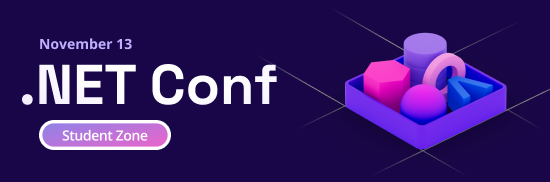

# November 13 @ 3:00pm UTC
The 2023 .NET Conf Student Zone is coming! **November 13, 3:00pm UTC**, tune in to the [.NET YouTube Channel](https://aka.ms/dotnet/youtube) to watch the event.

✅Register: [https://aka.ms/netconf23/registration](https://aka.ms/netconf23/registration)
💻Official Event Page: [https://aka.ms/netconf23/studentpage](https://aka.ms/netconf23/studentpage)

## 💡What is the .NET Conf Student Zone?
As part of [.NET Conf this year](https://www.dotnetconf.net/), we are hosting a .NET Student Zone on Monday, November 13! This is a livestreamed event where experts will introduce you to .NET and and build awesome, follow-along projects. You will walk away with a project portfolio on your very own portfolio website. In total the event will be 4+ hours of content.

## 🏋How to prepare for the event

We have free content to get you started using C# and .NET!

1. [Foundational C# Certification with freeCodeCamp](https://aka.ms/csharp-certification) - Learn C# with high quality training material. Walk away with a certification that you can put on your LinkedIn.
2. [.NET training content on Microsoft Learn](https://learn.microsoft.com/training/dotnet/) - Choose from our collection of free, self-paced, .NET tutorials.
3. [Student Zone Event Page](https://aka.ms/netconf23/studentpage) - Find more resources on the .NET Conf Student Zone event page!

## ⌚Agenda

| | Session Title | Topic | Speaker(s) | Session Code | Video |
| --- |-------|----------|---------|-----------|---|
| 0 | Welcome to the Student Zone!| Introduction  |  | *Coming soon* | *Coming soon* |
| 1️ | Building Your Own Course Assistant with AI | Artificial Intelligence, *Semantic Kernel*  | Luis Quintanilla, Kinfey Lo | *Coming soon* | *Coming soon* |
| 2 | Minimal API + SPA, a perfect match | Web Back-end, *Minimal APIs*  | Aaron Powell | *Coming soon* | *Coming soon* |
| 3 | Building an intelligent app with Blazor and Azure OpenAI | Web Front-end, *Blazor*  | Justin Yoo | *Coming soon* | *Coming soon* |
| 4 | Get started building mobile & desktop apps with .NET | Mobile, *.NET MAUI*  | Becky Buckler, Maddy Montaquila | *Coming soon* | *Coming soon* |
| 5 | Games in Godot! Let’s make a classic Paddle game with C#! | Gaming, *Unity, Godot*  | Michael Hawker | *Coming soon* | *Coming soon* |
| 6 | .NET Backend Mastery for Game Development | Gaming, *Unity*  | Eric Mwenda | *Coming soon* | *Coming soon* |
| 7 | Coding a Drone Using .NET and ChatGPT AI & Flying in MR! | Gaming, *Unity, Mixed Reality*  | Zaid Zaim | *Coming soon* | *Coming soon* |

## 🔎Using this repository
*You can use this repository locally or within a GitHub Codespace.*

### Local development
To use this repository, clone it to your local machine and use [VS Code](https://code.visualstudio.com/) for development. You will need the following extensions:
1. [C# Dev Kit](https://marketplace.visualstudio.com/items?itemName=ms-dotnettools.csdevkit)
1. [.NET MAUI](https://marketplace.visualstudio.com/items?itemName=ms-dotnettools.dotnet-maui)

### GitHub Codespaces

Follow these steps to open this sample in a Codespace:
1. Click the green **Code** drop-down menu and select the **Codespaces** option.
1. Select **+ New codespace** at the bottom on the pane.

For more info, check out the [GitHub documentation](https://docs.github.com/en/free-pro-team@latest/github/developing-online-with-codespaces/creating-a-codespace#creating-a-codespace).

## 🌱Resources 

Microsoft Student Offerings
1. [Microsoft Student Resources](http://aka.ms/learnstudent)  
1. [Azure for Student](http://aka.ms/azure4student) 
1. [GitHub Student Developer Pack](http://aka.ms/GitHubStudentPack) 

.NET Learning Resources
1. [Learn more C# and .NET](https://aka.ms/mslearn-dotnet)    
1. [Beginner video series](https://aka.ms/dotnetvideos)
1. [.NET Learning Paths on Microsoft Learn](https://aka.ms/mslearn-dotnet) 

Watch [.NET Conf](https://www.dotnetconf.net/)! Sessions start November 14th.

## 🎤Speakers

[**Luis Quintanilla**](https://www.lqdev.me/hi) - Luis is a Program Manager at Microsoft who's passionate about helping others get started building AI solutions in .NET.

**Kinfey Lo** - Kinfey Lo is Microsoft Senior Cloud Advoate, focus on artificial intelligence and big data applications.

[**Aaron Powell**](https://twitter.com/slace) - Aaron is a Developer Advocate at Microsoft with a passion for JavaScript, .NET, whacky ideas and running long distances.

[**Justin Yoo**](https://twitter.com/justinchronicle) - Justin is a Senior Cloud Advocate from Microsoft. He is always looking for easy and convenient ways to build intelligent applications using the cutting-edge technologies with .NET and Azure.

[**Maddy Montaquila**](https://twitter.com/maddymontaquila) - Maddy Montaquila is a Senior Product Manager on the .NET MAUI team. She loves helping developers be more productive by creating tooling to help them write code!

[**Becky Buckler**](https://twitter.com/BucklerBecky) - After a decade of teaching math and art, Becky Buckler made the switch into tech. She is currently a Product Manager on the .NET Growth team.

**Michael Hawker** - Michael Hawker is a Senior Software Engineer at Microsoft. In his spare time, he loves tinkering with board and video game design and programming.

[**Eric Mwenda**](https://twitter.com/eric__mwenda) - As a seasoned game developer and backend engineer, my creations reflect a blend of engaging gameplay and seamless performance. Using the depth of .NET, I’m actively reshaping how players experience modern gaming.

[**Zaid Zaim**](https://twitter.com/ZaidZaim2k) - Zaid Zaim, a Spatial Computing Expert and three-time Microsoft MVP, is known for his innovative work in augmented reality and Metaverse. A celebrated technopreneur, Zaid has spoken at TED Conferences, GITEX, WeAreDevelopers World Congress and is a force at ignore gravity, focused on innovation and solving organizational challenges with advanced technology.

## Trademarks

This project may contain trademarks or logos for projects, products, or services. Authorized use of Microsoft 
trademarks or logos is subject to and must follow 
[Microsoft's Trademark & Brand Guidelines](https://www.microsoft.com/en-us/legal/intellectualproperty/trademarks/usage/general).
Use of Microsoft trademarks or logos in modified versions of this project must not cause confusion or imply Microsoft sponsorship.
Any use of third-party trademarks or logos are subject to those third-party's policies.
